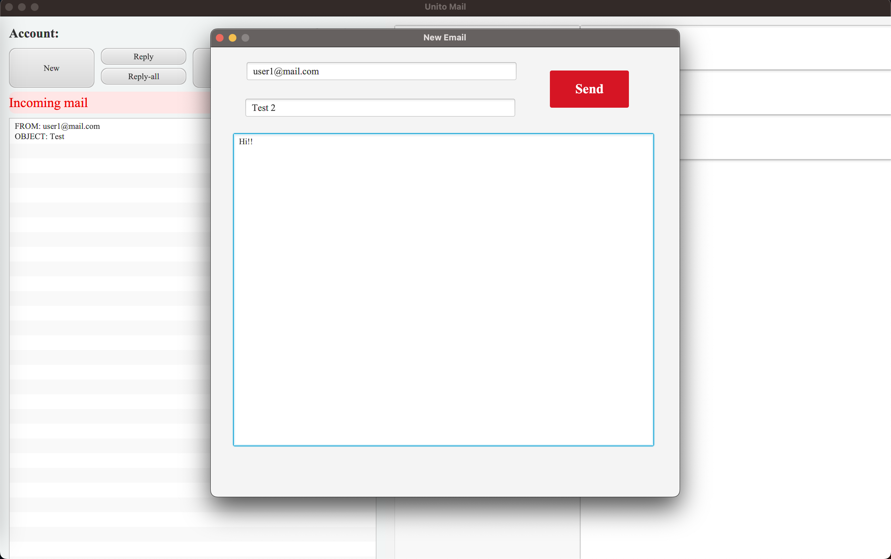
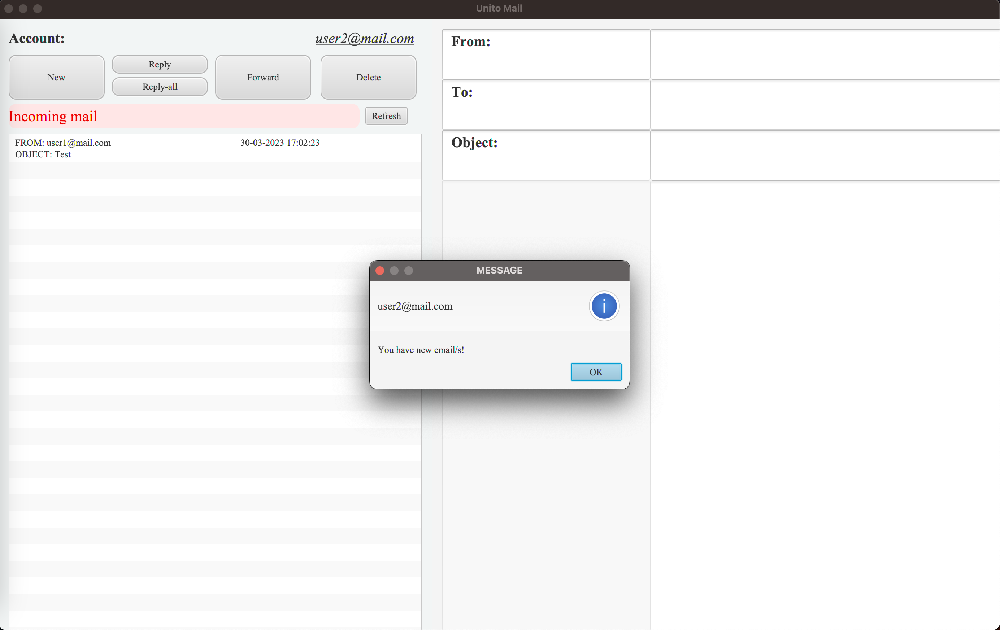
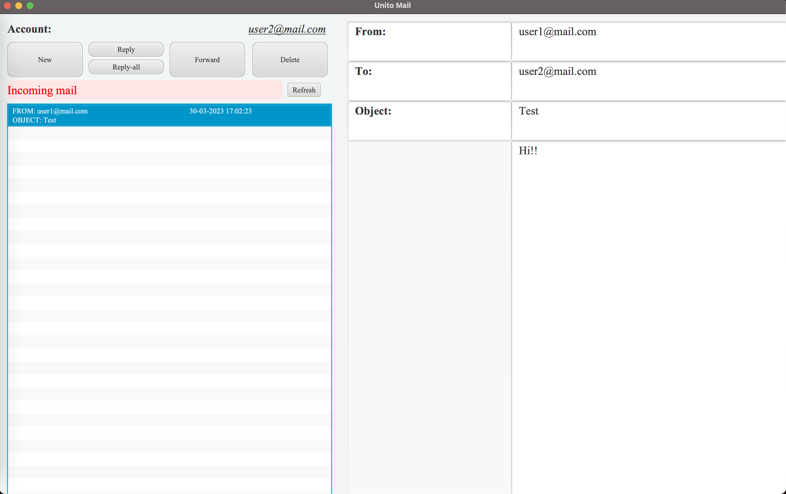
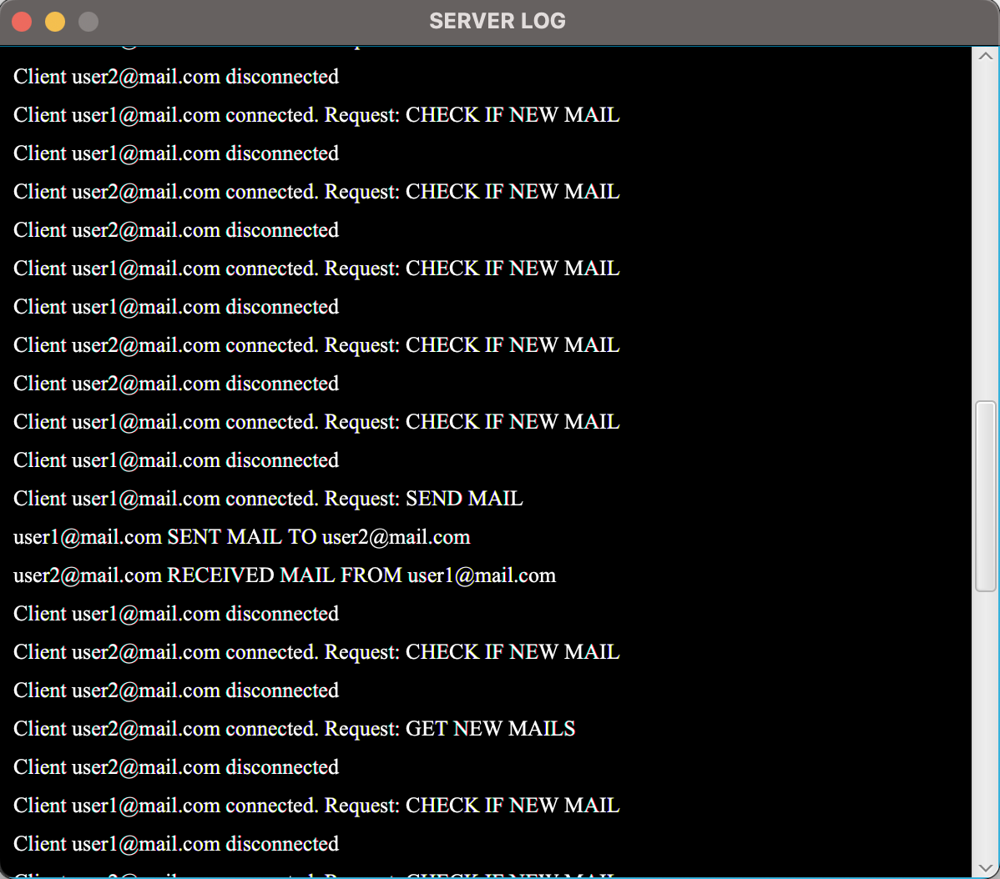

# Mailing System
---
Simple Java application developed on Java for a university course project that implements an electronic mail service organized with a mail server that manages users' mailboxes and the mail clients  needed to allow users to access their mailboxes

## Technical Requirements and Architecture
---
- For testing purposes there are 3 email users communicating with each other. However, the system design allow to scalable to many users
- The application is developed in Java (**JavaFXML**) and based on **MVC architecture**, with Controller + Views and Model, following the principles of the **Observer Observable** pattern. Any communication between Views and Model is mediated by the controller or supported by the Observer Observable pattern
- The application allow the user to correct any incorrect inputs (eg, in case of entering non-existent e-mail addresses, the server send an error message to the client who sent the message; furthermore, in case of inserting syntactically incorrect addresses, the client itself must report the problem without attempting to send the messages to the server)
- Clients and the application server *parallelize* tasks that do not need to be executed sequentially and handle any problems accessing mutually exclusive resources
- The application is distributed (mail clients and server can be on separate JVMs) through the use of **Java Sockets**

## GUI 
---
#### Client

#### Server

